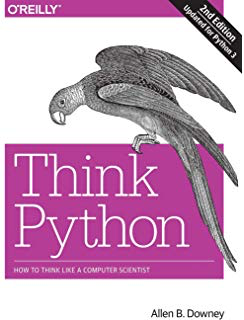

# Notes and Exercises
## for **Think Python** by _Allen B. Downey_

### Description
A more detailed reading (notes and exercises) of a book I've had for awhile. 

### Book Details
- Paperback: 300 pages
- Publisher: O'Reilly Media; 1 edition (August 23, 2012)
- Language: English
- ISBN-10: 144933072X
- ISBN-13: 978-1449330729

